<p align="center">
  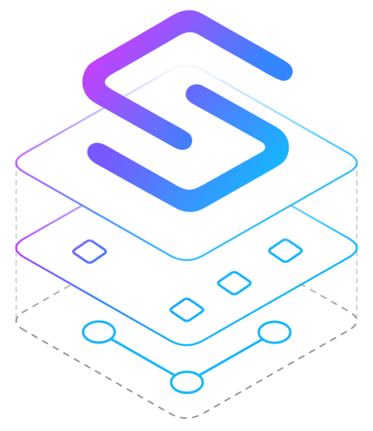
</p>

# squinch

<p align="center">
  <a href="https://github.com/jquatier/squinch/actions/workflows/ci.yml"></a>
  <a href="LICENSE"></a>
  
  
  
  <a href="https://www.npmjs.com/package/squinch"></a>
  <!-- npm downloads badge: uncomment once shields.io has indexed download stats
       (renders "package not found or too new" in red for a freshly published package).
  <a href="https://www.npmjs.com/package/squinch"></a>
  -->
</p>

> *squinch (n.) — the corner arch that lets a round dome sit on a square room; the
> piece of architecture that makes mismatched structures fit together.*

<p align="center">
  <a href="https://squinch.cc/">squinch.cc</a> ·
  <a href="https://squinch.cc/playground/">Playground</a> ·
  <a href="https://squinch.cc/lookbook/">Lookbook</a> ·
  <a href="https://squinch.cc/install/">Install</a>
</p>

**Your coding agent already knows the architecture — now it can draw it.**
Describe the system in a paragraph: a DSL that LLMs write fluently and humans
control precisely, real layout and edge-routing control, cloud icon packs,
and diagrams you can zoom into — from the whole landscape down to one
service's internals.

## From description to diagram

<p align="center">
  <picture>
    <source media="(prefers-color-scheme: dark)" srcset="docs/assets/prompt-dark.gif">
    
  </picture>
  <br>
  <em>One paragraph in, a diagram out — the agent writes the model, Squinch
  renders it.</em>
</p>

Hand your coding agent the bundled
[skill](packages/skill) and describe the system in a paragraph. It writes the
`.squinch` model, `squinch check` tells it what is wrong in terms it can act on,
and `squinch render` produces the SVG — deterministic, reviewable in a pull
request, and living in git beside the code it describes. The diagram above is
[examples/products-api](examples/products-api); its source is
[further down this page](#from-source-to-diagram), and CI holds the two
together.

## Zoom into any system

<p align="center">
  <picture>
    <source media="(prefers-color-scheme: dark)" srcset="docs/assets/zoom-dark.gif">
    
  </picture>
  <br>
  <em>Click a system to go inside it, the breadcrumb to come back up. Any
  system opens — the altitude is a property of the model, not a second
  diagram. And when you want everything at once, <code>expand&nbsp;*</code>
  opens all of them on one page.</em>
</p>

**C4-style zoom, from one model.** The altitudes are derived, never drawn twice:
a collapsed system is a card previewing what is inside; opening it shows the
internals while the neighbours it talks to stay on screen as muted context; and
edges that crossed the boundary re-anchor themselves, aggregating behind a count
badge when several collapse into one. Nothing is duplicated, so nothing can
drift — see [examples/microservices](examples/microservices) for the source.

## Features

- **LLMs write it fluently.** Give your coding agent the bundled
  [skill](packages/skill) and ask for a diagram of your system. The language was
  designed for agents to author rather than retrofitted for them, so what comes
  back is a correct diagram, not one you have to redraw.
- **1,302 real vendor icons.** AWS, Azure, Kubernetes and product logos, not
  grey boxes with labels on them.
- **Auto-layout that gets it right, and lets you overrule it.** Good diagrams
  with no hints at all; when you disagree, steer it with `rows`,
  `place right-of`, `align` and explicit edge routing — relative hints, never
  pixel coordinates.
- **Many diagrams from one description.** A landscape view, a per-service view,
  a filtered view for an audit — all from the same source, so they cannot
  disagree with each other. Tag things `#pci` and get a view that dims
  everything else.
- **Click into any system.** C4-style altitudes from a single model, so there's
  no second diagram to keep in sync.
- **Deployment boundaries drawn properly.** VPCs, subnets, cloud and on-prem
  zones — nested, tinted by kind, with the boundary label straddling the border
  where you expect it.
- **Trace a request through the system.** Declare a flow and its steps are
  numbered along the edges in order — and in the interactive export you can
  walk it one hop at a time.
- **Exports to SVG, PNG, or one interactive HTML file.** SVG drops straight
  into a README (including a single file that follows the reader's light or
  dark mode); the HTML carries every view with click-to-zoom and presentation
  mode, and needs no server, no internet and nothing installed by whoever you
  send it to.
- **A real VS Code extension.** Autocomplete, live errors with one-click fixes,
  and a preview that updates as you type.
- **Reviewable in a pull request.** The source is a handful of readable lines,
  so a reviewer sees the change itself — and `squinch diff` spells it out:
  "edge added: checkout → fraud", not a thousand lines of changed path data.
- **Generated in CI, source kept in git.** The `.squinch` file lives next to the
  code it describes, and a ready-made GitHub Action re-renders on every push —
  failing the build when a committed diagram has drifted, so the picture in your
  README is never stale.
- **Light and dark.** Dark is designed, not inverted — and one `--adaptive`
  file can carry both, switching with the reader's `prefers-color-scheme`.

## Install

The agent skill is the front door — one command, then ask your agent for a
diagram:

```bash
npx squinch skill
```

That writes `.agents/skills/` in your project (plus `.claude/skills/` when it
detects Claude Code); `--global` does the same under your home directory, and
`--print` emits SKILL.md for any other harness. macOS, Linux and Windows, on
Node ≥ 22.

The other surfaces, each its own one-liner:

- **The CLI** — `npm i -g squinch` (or run everything through
  `npx squinch <cmd>`), and the first render is two commands:
  `squinch init my-diagrams`, then `squinch render my-diagrams --sync`.
- **The Claude Code plugin** — the same skill without touching your repo:
  `/plugin marketplace add jquatier/squinch`, then
  `/plugin install squinch@squinch`. Updates arrive with the plugin instead
  of living in your tree.
- **The Codex plugin** — the same directory, packaged as an
  [Agent Plugin](https://agent-plugins.org): `codex plugin marketplace add
  jquatier/squinch`, then `codex plugin add squinch@squinch`. Cursor, Copilot
  and Kiro read the same manifest.
- **The VS Code extension** — download `squinch-vscode-<version>.vsix` from
  [Releases](https://github.com/jquatier/squinch/releases) and
  `code --install-extension` it. The same file installs in Cursor, Windsurf
  and VSCodium.
- **CI** — `uses: jquatier/squinch/.github/actions/squinch-check@main` fails
  the build when a committed SVG is stale;
  [`squinch-diff`](.github/actions/squinch-diff) comments what changed,
  architecturally, on the PR. Pin the `version` input: rendering is
  deterministic *per tool version*, so a floating `latest` can change your
  goldens on someone else's release day.
A path can be a single file or a directory — a directory is one project, and
its files share a namespace.

| Command | |
| --- | --- |
| `check` | parse + lint; `--format json` for agents |
| `render` | `--view`, `--theme`, `--adaptive`, `--sync`, `--check`; `-o out.png` rasterizes (`--scale`, `--width`, `--background`), `-o out.html` exports the interactive viewer |
| `diff` | semantic model diff — `--base <ref>`, `--format markdown`, `--fail-on structural\|any` for CI |
| `icons search` | find an icon id across installed packs |
| `init` | scaffold a starter project |
| `skill` | install the agent skill |
| `watch` | re-render on change |

## From source to diagram

The whole file — structure first, then a separate `view` that says how to draw
it. No coordinates anywhere: the boundary says what is inside the VPC, and the
layout falls out of the graph.

<!--
  This block is Squinch, not Kotlin — it is fenced as `kotlin` only to get syntax
  colour on GitHub. Linguist has no `squinch` grammar, so a ```squinch fence renders
  flat grey; Kotlin's tokeniser happens to fit this DSL almost exactly (it gets every
  // comment and quoted string right, and picks out `->`), so we borrow it. Nothing
  here is valid Kotlin. Swap the fence back to `squinch` if Linguist ever ships a
  grammar — packages/vscode/syntaxes/squinch.tmLanguage.json is the one to submit.
-->

```kotlin
// A products API on AWS: edge, a service in a VPC, a self-warming index.
pack aws

person shopper "Shopper"

cdn = aws/cloudfront "CloudFront"

alb = aws/elb     "Application Load Balancer"
app = aws/fargate "Products API" {
  description: "ECS on Fargate, private subnets across two AZs"
}

db      = aws/dynamodb   "Products Table" datastore {
  description: "Single-table design, on-demand capacity"
}
indexer = aws/lambda     "Stream Indexer"
search  = aws/opensearch "Search Index" datastore

shopper -> cdn "api.example.com"
cdn -> alb "/products/*"
alb -> app
app -> db     "read / write"
app -> search "search products"

// A stream needs a consumer — this is what keeps the index in step.
db ~> indexer "DynamoDB stream"
indexer -> search "index updates"

zone vpc "VPC prod-main" vpc {
  contains alb, app
  icon: aws/vpc
  label: bottom-right   // clear of the edge arriving at the top
}

view products {
  title "Products API — edge to index"
  legend auto
  layout {
    // `alb` names the VPC's rank — one member is enough to place a zone.
    rows [shopper cdn] [alb] [db indexer search]
  }
}
```

<picture>
  <source media="(prefers-color-scheme: dark)" srcset="examples/products-api/products-api.products.dark.svg">
  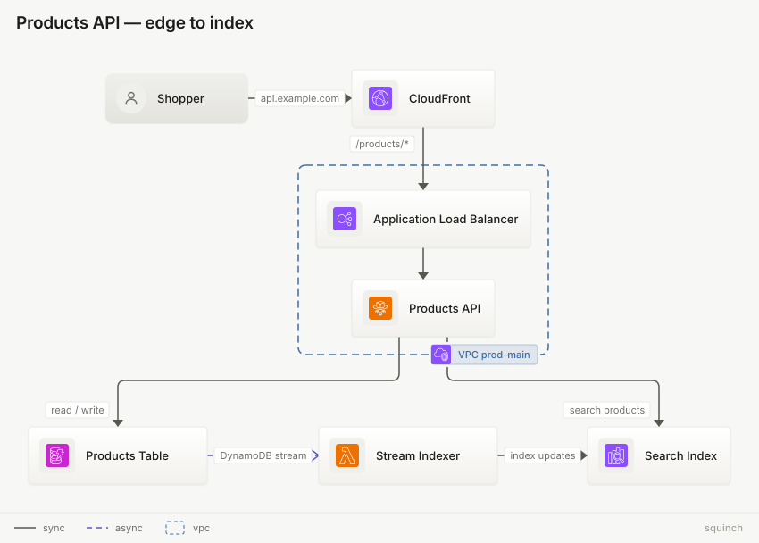
</picture>

## Why

Auto-layout tools give you no recourse when the picture comes out wrong: add a node
and everything reshuffles, edges cross, and your only option is to accept it. Manual
tools give you control but an un-diffable file. Squinch takes the third path —
excellent auto-layout by default, plus *relative* hints (never pixel coordinates)
that both humans and LLMs can reason about:

- **`rows [api] [create get search]`** — pin ranks and their order
- **`place sync right-of db`** — relative placement, no geometry
- **`align get db`** — put two nodes on a shared axis
- **`route db ~> sync from east to west`** — pick the sides an edge leaves *and* enters

Three tiers, in the order you reach for them: auto-layout underneath, relative
placement on top of it (`rows`, `cols`, `place`, `align`), explicit edge routing
last (`route`, `channel`). Delete every hint and the diagram still renders well.

Hints that contradict each other are **check-time errors, never silently
dropped** — a dropped hint strands the agent loop, a named conflict gets fixed
in one iteration:

```
conflict.squinch:9:5  error: contradictory place hints: `s.a` vs `s.b` reference each other
  remove one of the two place statements
```

## What it can draw

Every picture below is a committed render from [lookbook/](lookbook/), rebuilt
and byte-compared on every push — so none of them can quietly stop being true.

<table>
<tr>
<td width="50%" valign="top">
<picture>
  <source media="(prefers-color-scheme: dark)" srcset="lookbook/out/17-zones.landscape.dark.svg">
  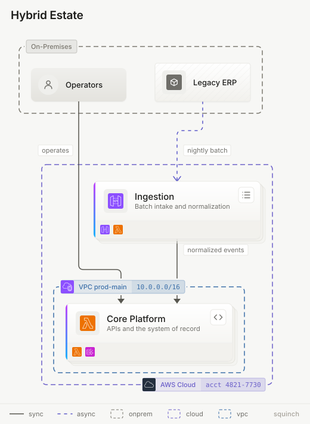
</picture>
<b>Deployment boundaries</b><br>
<code>zone</code> — cloud, VPC, on-prem, nested, each kind-tinted, with chips that straddle the border
</td>
<td width="50%" valign="top">
<picture>
  <source media="(prefers-color-scheme: dark)" srcset="examples/notifications/notifications.pipeline.dark.svg">
  
</picture>
<b>Motion that carries meaning</b><br>
Events arrive as <code>packets</code>, the archive job drifts <code>slow</code>, and a <code>comet</code> rides the final push at 150px/s — CSS keyframes, each at its own constant speed, animating right here in this README
</td>
</tr>
<tr>
<td width="50%" valign="top">
<picture>
  <source media="(prefers-color-scheme: dark)" srcset="lookbook/out/18-flows.shop.dark.svg">
  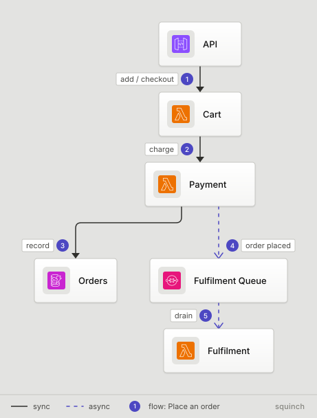
</picture>
<b>Numbered flows</b><br>
<code>flow</code> declares a request path; <code>show flow</code> badges the steps in order along the edges
</td>
<td width="50%" valign="top">
<picture>
  <source media="(prefers-color-scheme: dark)" srcset="lookbook/out/16-legend-titleblock.pay.dark.svg">
  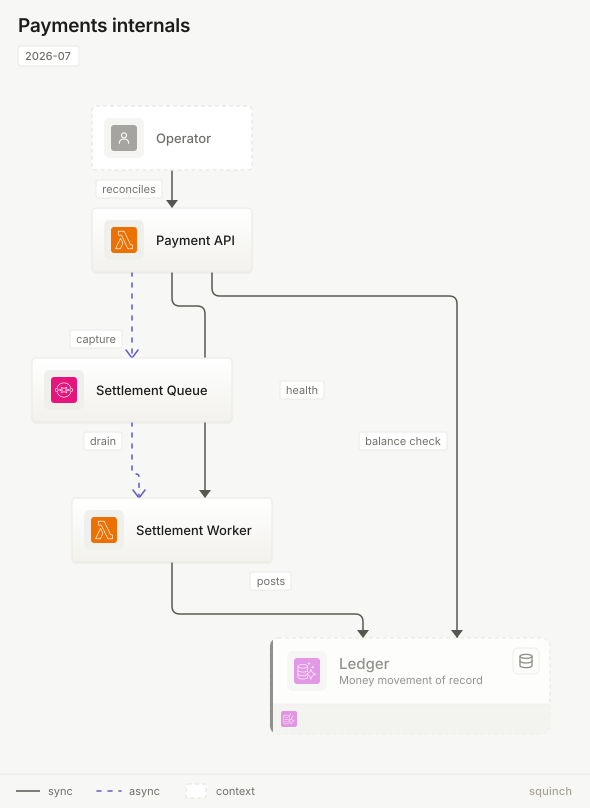
</picture>
<b>Legend and titleblock</b><br>
<code>legend auto</code> keys only the styles the diagram actually uses; <code>titleblock</code> is drafting-style metadata
</td>
</tr>
<tr>
<td width="50%" valign="top">
<picture>
  <source media="(prefers-color-scheme: dark)" srcset="lookbook/out/22-channel.bussed.dark.svg">
  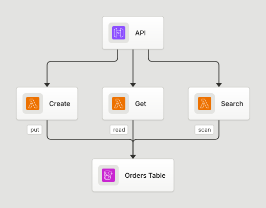
</picture>
<b>Channel trunks</b><br>
<code>channel a, b, c -&gt; db</code> collapses many converging edges into one trunk instead of a fan
</td>
<td width="50%" valign="top">
<picture>
  <source media="(prefers-color-scheme: dark)" srcset="lookbook/out/14-sidecar-routes.app.dark.svg">
  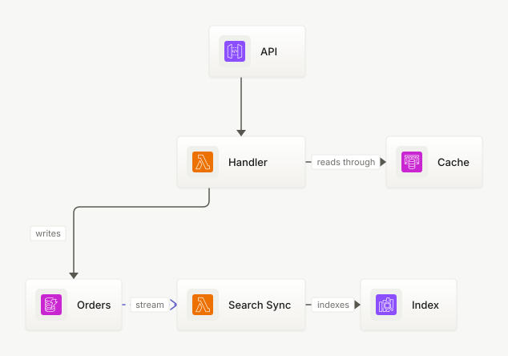
</picture>
<b>Edge routing</b><br>
<code>place</code> puts the sidecar beside its owner; <code>route … from east to west</code> picks the sides
</td>
</tr>
<tr>
<td width="50%" valign="top">
<picture>
  <source media="(prefers-color-scheme: dark)" srcset="lookbook/out/21-logos.landscape.dark.svg">
  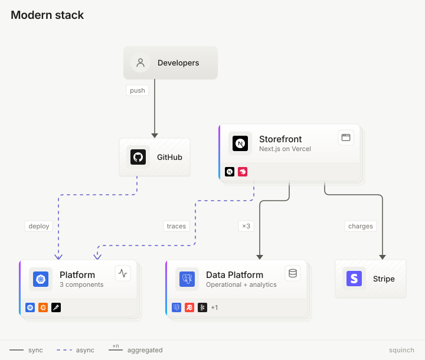
</picture>
<b>Beyond the clouds</b><br>
<code>pack logos</code> for the non-cloud half of a stack, plated and tinted; the <code>×n</code> badge aggregates lifted edges
</td>
<td width="50%" valign="top">
<picture>
  <source media="(prefers-color-scheme: dark)" srcset="lookbook/out/20-align-hops.s.dark.svg">
  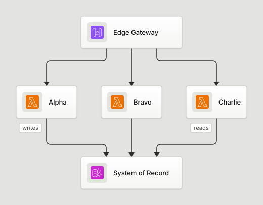
</picture>
<b>Craft details</b><br>
<code>align</code> snaps nodes onto one axis, and crossing edges hop rather than blur into a junction
</td>
</tr>
<tr>
<td width="50%" valign="top">
<picture>
  <source media="(prefers-color-scheme: dark)" srcset="lookbook/out/10-highlight-notes.pci.dark.svg">
  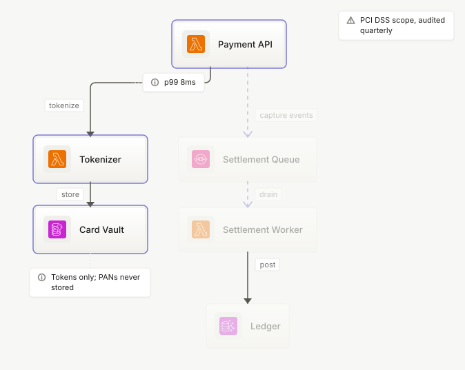
</picture>
<b>Tag lenses and notes</b><br>
<code>highlight #pci</code> dims everything off-topic; notes anchor to the node they are about
</td>
<td width="50%" valign="top">
<picture>
  <source media="(prefers-color-scheme: dark)" srcset="lookbook/out/30-badges.lakehouse.dark.svg">
  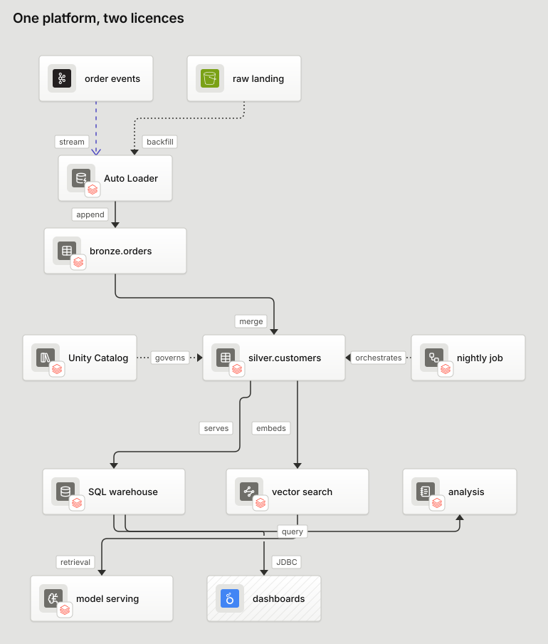
</picture>
<b>Vendors with no icon pack</b><br>
<code>badge: logos/databricks</code> marks a generic <code>sys/*</code> concept as someone's platform — the licence-clean way to draw a vendor that ships no redistributable icons
</td>
</tr>
<tr>
<td width="50%" valign="top">
<picture>
  <source media="(prefers-color-scheme: dark)" srcset="lookbook/out/34-view-axes.audit.dark.svg">
  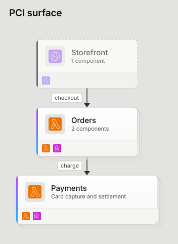
</picture>
<b>The audit view</b><br>
<code>only #pci</code> keeps the tagged slice and drops the rest — a view <code>scope</code> could never name, because tags cut across systems. The untagged caller survives only as a muted context card: the assessor sees the entry point, drawn as periphery
</td>
<td width="50%" valign="top">
<picture>
  <source media="(prefers-color-scheme: dark)" srcset="lookbook/out/33-card-shelf.landscape.dark.svg">
  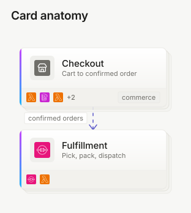
</picture>
<b>Cards that carry their metadata</b><br>
<code>icon:</code> gives a system its own mark, <code>domain:</code> stamps the shelf, and past three children the preview truncates to <code>+N</code>
</td>
</tr>
</table>

Also in the language: `cols` to pin the other axis, `datastore` / `external`
node kinds, descriptions, and container nesting. Async edges (`~>`) are dashed
and animate at a constant speed — CSS keyframes, never script. Full grammar in
[docs/SPEC.md](docs/SPEC.md).

## Written by agents, and tested that way

The claim on the tin is that an LLM can write this fluently. That is a testable
claim, so it gets tested.

Errors are built for the agent loop, not just for humans: every diagnostic
carries a location, the problem, and a likely fix, with did-you-mean suggestions
for unknown icons, views and identifiers. `squinch check --format json` emits
exactly the same information a person sees.
[`SKILL.md`](packages/skill/skills/squinch/SKILL.md) is the whole contract an
agent needs — `npx squinch skill` installs it for every skills-compatible agent
(or paste it into whatever your harness calls context), then ask for a diagram
in plain language; [the package README](packages/skill/) has the details.

The **gauntlet** is the acceptance test: twenty-nine natural-language
architecture prompts, each solved *cold* by a fresh agent given only SKILL.md
and the CLI —
no examples, no human layout fixes, no coaching. A deterministic scorer checks
the structure, icons, tags and views of every solution, and CI regression-tests
the whole corpus on every push.

The agents are kept genuinely cold, and physically so: each one runs in a
sandbox holding nothing but SKILL.md, its prompt and a `squinch` binary, with
this repository unreachable from inside — no examples, no docs, no engine
source, and no previous answers to copy. Every prompt is re-run from scratch as
the language grows, and the bar rises with it — the corpus has gone
10 → 16 → 20 → 29 prompts as zones, flows, tag lenses, channels, more packs
and the positional-tag grammar landed.

The current round scores **29/29** with zero human layout fixes. Every round is
written up in [gauntlet/README.md](gauntlet/README.md) — what was asked, how it
was run, and what came back.

## Deterministic by construction

The same source, packs, and theme always produce **byte-identical SVG** — text is
measured from a bundled metrics table, never from the environment, and CI
byte-compares the goldens on macOS, Linux and Windows, so the guarantee holds
across platforms and not just across runs. That makes a lockfile workflow
possible:

```bash
squinch render diagrams/ --sync    # write SVGs for every view × theme, refresh squinch.lock
squinch render diagrams/ --check   # CI gate: fail if a committed SVG is stale
```

Commit the source *and* the render. Reviewers see the picture in the diff; CI makes
sure it never drifts from the source. (Add `.github/actions/squinch-check` to your
workflow to enforce it.)

And when the picture changes, `squinch diff` says what changed in the
architecture's own vocabulary, not in path data:

```console
$ squinch diff diagrams/ --base main
structural
  + node      cache "Hot Cache" (aws/elasticache)
  + edge      app -> cache "session reads"

2 structural, 0 cosmetic
```

Structural changes are new boxes and arrows; cosmetic ones are labels,
descriptions and styling. `--format json | markdown` and
`--fail-on structural` are built in, so a PR comment or a "no architecture
changes slipped in" gate is one CLI call, not a parser.

### One file that follows the reader's theme

Embedding a diagram somewhere you don't control the background — a docs site, a
wiki, an internal portal — usually means shipping two files and a `<picture>`.
`--adaptive` folds both palettes into one SVG and lets `prefers-color-scheme`
pick:

```bash
squinch render diagrams/ --view landscape --adaptive -o architecture.svg
```

The light theme stays in the presentation attributes and the dark one rides in a
`@media` block, so anything that ignores CSS — including the resvg rasterizer
behind PNG export — still draws the light theme correctly rather than nothing.
It costs under 2% over a single render, versus two whole files. Still no
script: a stylesheet is not code.

## Themes

Two, and dark is designed rather than inverted — not a palette flipped through
a filter. The same two nodes, both ways:

<table>
<tr>
<th align="center"><code>light</code></th>
<th align="center"><code>dark</code></th>
</tr>
<tr>
<td align="center">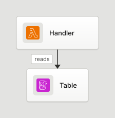</td>
<td align="center">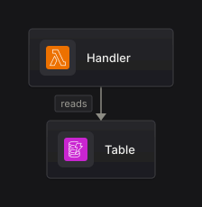</td>
</tr>
</table>

`--adaptive` folds the pair into one file behind `prefers-color-scheme`, so an
embedded diagram follows the reader's OS without you picking a side.

The [lookbook](lookbook/) renders 35 deliberately awkward cases — dense meshes,
long labels, deep nesting, coplanar rows — to 86 committed SVGs across the
themes, and CI fails if any of them changes unintentionally.

## Icons

**1,302 marks across five packs**, all chosen because they can be
redistributed:

| Pack | Count | Terms |
| --- | --- | --- |
| [`pack-aws`](packages/pack-aws) | 316 | CC-BY-ND 2.0 — the same basis AWS uses for its own PlantUML icons |
| [`pack-azure`](packages/pack-azure) | 636 | Microsoft's icon terms: copy and distribute **for architecture diagrams, training and documentation** |
| [`pack-logos`](packages/pack-logos) | 147 | CC0, from [Simple Icons](https://simpleicons.org) — the non-cloud half of a stack |
| [`pack-sys`](packages/pack-sys) | 164 | ISC, from [Lucide](https://lucide.dev) — the generic set: servers, hardware, network gear, shapes, data/ML concepts |
| [`pack-k8s`](packages/pack-k8s) | 39 | Apache-2.0 / CC-BY-4.0 — the official [Kubernetes community icons](https://github.com/kubernetes/community/tree/main/icons), published to standardize cluster diagrams |

```console
$ squinch icons search factory
azure/data-factories
sys/factory  (or sys/onprem, sys/plant)
```

Aliases collapse onto the canonical id, so the word you reach for usually works
— `gear`, `cube`, `db`, `rack`, `firewall`, `vault`, `cron` all land somewhere
sensible. `sys/*` is the generic half, for everything no cloud vendor draws. A
`pack` statement is optional for every installed pack — it validates the name
at check time and documents what the file draws from, but nothing gates on it;
it becomes load-bearing when local packs (`pack corp from "./icons"`) land.

Two constraints travel to you, not just to us. The **cloud** artwork must not be
modified — not recoloured, not reshaped, not run through an SVG optimizer;
Squinch applies all theme treatment at render time and never touches the asset.
And Azure's grant is narrower than an open-source licence: it covers
architecture diagrams, training and documentation, and does not travel to other
uses. Lucide's ISC and Simple Icons' CC0 carry no such limits, though those are
shipped verbatim too so `npm run fetch` can pick up upstream fixes without
re-applying local edits. Each pack's NOTICE has the details.

Deliberately absent: GCP. Google grants permission to *use* its Cloud icons in
diagrams but publishes no redistribution grant, so we don't ship them.

## Editor support and a playground

The **VS Code extension** is a real language server — completions that know
which block you're in, live diagnostics with quick fixes, hover, document
symbols, and a preview pane that re-renders as you type.

The **playground** is the app in the zoom animation above: click a system to
dive into it, walk a flow one hop at a time, ⌘K to search 1,302 icons, and
full-screen the declared views as a presentation deck. It lives at
[squinch.cc/playground](https://squinch.cc/playground/) — nothing you draw
leaves your browser — or run it locally with `pnpm --filter @squinch/spa dev`.

And that zooming travels. `render -o diagram.html` writes **one self-contained
file** carrying every view, both palettes and the viewer itself — click into a
system, walk a flow, present it full-screen, all from a file you can email or
drop on a static host:

```bash
squinch render diagrams/ -o architecture.html
```

It fetches nothing, and the entry view is inline, so a reader with JavaScript
disabled still sees a diagram. That export is the *one* artifact allowed to
carry a script, and it is a separate class rather than a loophole: the SVGs
inside it are byte-for-byte what `render -o x.svg` produces, the viewer is
their sibling and never their content, and a test asserts nothing executable
survives removing the two `<script>` elements
([docs/notes/html-export.md](docs/notes/html-export.md)). Exported `.svg` never
contains script, full stop.

## Docs

- [DSL specification (v0 draft)](docs/SPEC.md)
- [Design language](docs/DESIGN.md)
- [Engineering constraints](docs/ENGINEERING.md) — performance budgets, verification, and what is deliberately not built
- [Engineering notes](docs/notes/) — decisions with their rejected alternatives
- [Examples](examples/) and the [lookbook](lookbook/)
- [Contributing](CONTRIBUTING.md) · [Security policy](SECURITY.md) · [Icon notices](NOTICE)

## Acknowledgments

Squinch's model/view approach builds on the ideas of the
[C4 model](https://c4model.com) for visualizing software architecture.

## License

Squinch itself is [Apache-2.0](LICENSE). The bundled icon artwork is **not** —
each pack is redistributed verbatim under its own terms, and that credit
travels with anything that serves the artwork (the playground carries it under
"icon credits"):

| Pack | Attribution | Terms |
| --- | --- | --- |
| [`pack-aws`](packages/pack-aws) | Amazon Web Services — [AWS Architecture Icons](https://aws.amazon.com/architecture/icons/) | [CC-BY-ND 2.0](packages/pack-aws/NOTICE) — attribution required, no derivatives |
| [`pack-azure`](packages/pack-azure) | Microsoft — [Azure Architecture Icons](https://learn.microsoft.com/en-us/azure/architecture/icons/) | [Microsoft's icon terms](packages/pack-azure/NOTICE) — architecture diagrams, training and documentation only |
| [`pack-k8s`](packages/pack-k8s) | © the Kubernetes Authors — [community icons](https://github.com/kubernetes/community/tree/main/icons) | [Apache-2.0 or CC-BY-4.0](packages/pack-k8s/NOTICE) — attribution required |
| [`pack-logos`](packages/pack-logos) | [Simple Icons](https://simpleicons.org) | [CC0-1.0](packages/pack-logos/NOTICE) — the marks remain their owners' trademarks |
| [`pack-sys`](packages/pack-sys) | [Lucide](https://lucide.dev), portions from Feather | [ISC](packages/pack-sys/NOTICE) (Feather portions MIT) |

Kubernetes and the Kubernetes logo are trademarks of The Linux Foundation;
brand marks in `pack-logos` belong to their respective owners. Use throughout
is nominative — identifying the thing a diagram depicts — and implies no
endorsement or affiliation. Each pack's NOTICE carries the full text and
records the fetch-time treatments applied.
