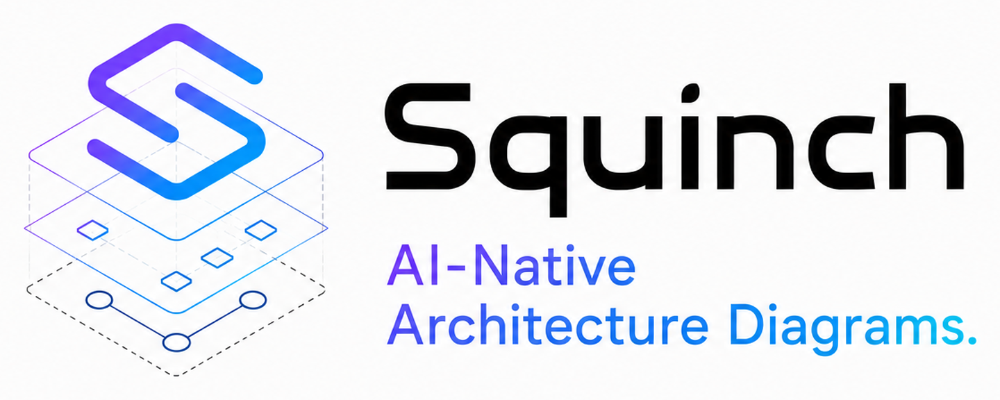
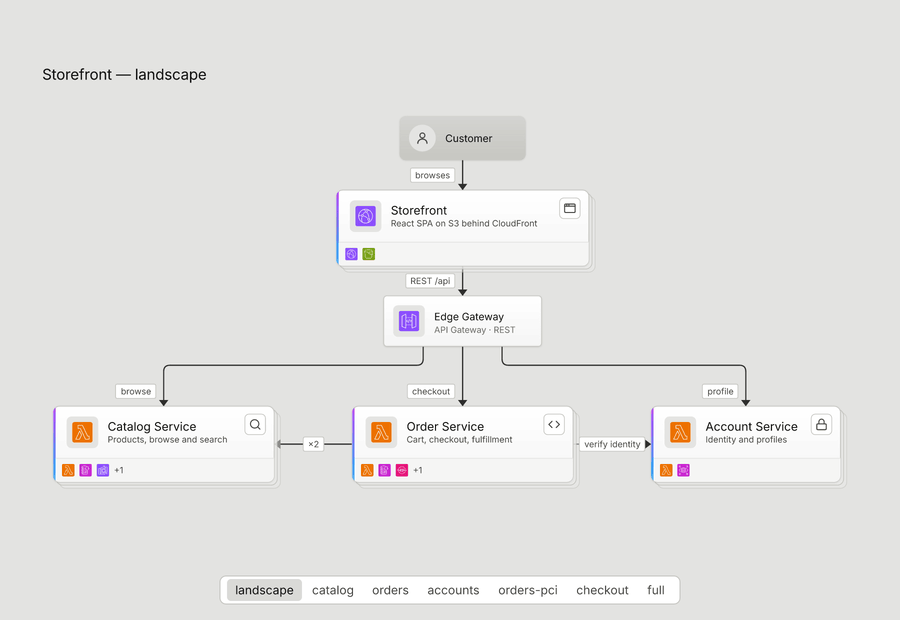
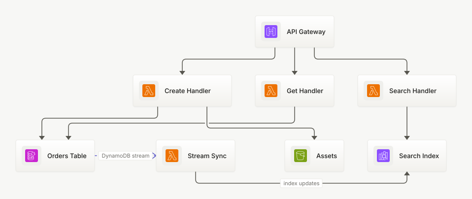
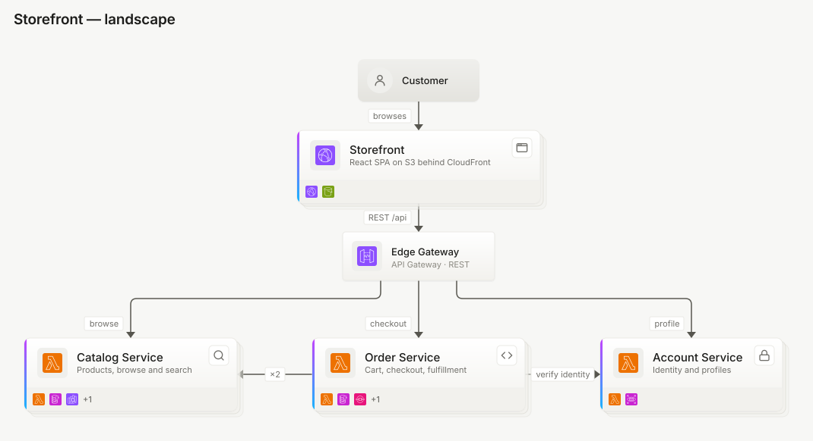
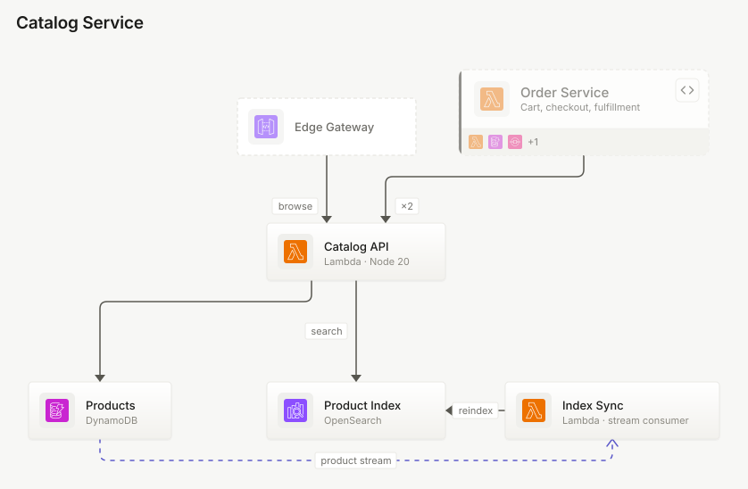

<p align="center">
  <picture>
    <source media="(prefers-color-scheme: dark)" srcset="docs/assets/logo-dark.png">
    
  </picture>
</p>

# Squinch

> *squinch (n.) — the corner arch that lets a round dome sit on a square room; the
> piece of architecture that makes mismatched structures fit together.*

**Architecture diagrams as code, built for the age of AI agents.** A DSL that LLMs
write fluently and humans control precisely — with real layout and edge-routing
control, cloud icon packs, C4-style zooming, and deterministic rendering that lives
in git next to the code it describes.

<p align="center">
  <picture>
    <source media="(prefers-color-scheme: dark)" srcset="docs/assets/zoom-dark.gif">
    
  </picture>
  <br>
  <em>Click a system to go inside it. One model, two altitudes — the card
  doesn't magnify, it opens, and the neighbours it talks to stay on screen as
  context. The breadcrumb takes you back up.</em>
</p>

## From source to diagram

The whole file — structure first, then a separate `view` that says how to draw
it. Delete the `layout` block and it still renders well; the hints only steer.

```squinch
pack aws

system orders "Order Service" {
  api    = aws/api-gateway "API Gateway"
  create = aws/lambda      "Create Handler"
  get    = aws/lambda      "Get Handler"
  search = aws/lambda      "Search Handler"
  db     = aws/dynamodb    "Orders Table" {
    description: "Single-table design, on-demand capacity"
    tags: #pci
  }
  files  = aws/s3          "Assets"
  idx    = aws/opensearch  "Search Index"
  sync   = aws/lambda      "Stream Sync"

  api -> create, get, search
  create -> db, files
  get    -> db
  search -> idx
  db  ~> sync "DynamoDB stream"
  sync -> idx "index updates"
}

view orders {
  theme dark
  layout {
    rows [api] [create get search] [db files idx]
    place sync right-of db
    route db ~> sync from east to west   // control the edge, not just the graph
  }
}
```

<picture>
  <source media="(prefers-color-scheme: dark)" srcset="examples/orders/orders.orders.dark.svg">
  
</picture>

## Status

🚧 **Pre-alpha.** It works end to end — parser, model, layout, renderer, CLI,
VS Code extension, browser playground, three icon packs — but nothing is
published to npm yet. Build from source (below) if you want to play.

## Why

Auto-layout tools give you no recourse when the picture comes out wrong: add a node
and everything reshuffles, edges cross, and your only option is to accept it. Manual
tools give you control but an un-diffable file. Squinch takes the third path —
excellent auto-layout by default, plus *relative* hints (never pixel coordinates)
that both humans and LLMs can reason about:

- **`rows [api] [create get search]`** — pin ranks and their order
- **`place sync right-of db`** — relative placement, no geometry
- **`route db ~> sync from east to west`** — say which side an edge leaves from

## Written by agents, and tested that way

The claim on the tin is that an LLM can write this fluently. That is a testable
claim, so it gets tested.

Errors are built for the agent loop, not just for humans: every diagnostic
carries a location, the problem, and a likely fix, with did-you-mean suggestions
for unknown icons, views and identifiers. `squinch check --format json` emits
exactly the same information a person sees. [`packages/skill/SKILL.md`](packages/skill/SKILL.md)
is the whole contract an agent needs.

The **gauntlet** is the acceptance test: twenty natural-language architecture
prompts, each solved *cold* by a fresh agent given only SKILL.md and the CLI —
no examples, no human layout fixes, no coaching. A deterministic scorer checks
the structure, icons, tags and views of every solution, and CI regression-tests
the whole corpus on every push.

The agents are kept genuinely cold: one prompt each, no shared context, and no
access to `examples/`, `lookbook/`, `docs/`, the gauntlet itself, or the engine
source. Every prompt is re-run from scratch as the language grows, and the bar
rises with it — the corpus has gone 10 → 16 → 20 prompts as zones, flows, tag
lenses, channels and a second cloud pack landed.

The current round scores **20/20** with zero human layout fixes. Every round is
written up in [gauntlet/README.md](gauntlet/README.md) — what was asked, how it
was run, and what came back.

## Deterministic by construction

The same source, packs, and theme always produce **byte-identical SVG** — text is
measured from a bundled metrics table, never from the environment. That makes a
lockfile workflow possible:

```bash
squinch render diagrams/ --sync    # write SVGs for every view × theme, refresh squinch.lock
squinch render diagrams/ --check   # CI gate: fail if a committed SVG is stale
```

Commit the source *and* the render. Reviewers see the picture in the diff; CI makes
sure it never drifts from the source. (Add `.github/actions/squinch-check` to your
workflow to enforce it.)

### One file that follows the reader's theme

Embedding a diagram somewhere you don't control the background — a docs site, a
wiki, an internal portal — usually means shipping two files and a `<picture>`.
`--adaptive` folds both palettes into one SVG and lets `prefers-color-scheme`
pick:

```bash
squinch render diagrams/ --view landscape --adaptive -o architecture.svg
```

The light theme stays in the presentation attributes and the dark one rides in a
`@media` block, so anything that ignores CSS — including the resvg rasterizer
behind PNG export — still draws the light theme correctly rather than nothing.
It costs about 1.5% over a single render, versus two whole files. Still no
script: a stylesheet is not code.

## C4-style zoom

One hierarchical model; altitudes are derived. Collapsed systems render as cards
with a preview of what is inside; zooming shows internals while neighbours collapse
into muted context cards, and cross-boundary edges re-anchor automatically —
aggregating with a count badge when several collapse into one.

<picture>
  <source media="(prefers-color-scheme: dark)" srcset="examples/microservices/microservices.landscape.dark.svg">
  
</picture>

Zoom into the catalog service and its API, table, search index and stream sync
appear — with the gateway and order service reduced to context:

<picture>
  <source media="(prefers-color-scheme: dark)" srcset="examples/microservices/microservices.catalog.dark.svg">
  
</picture>

Same model, no duplication — see [examples/microservices](examples/microservices).

## Beyond nodes and arrows

Structure is only half of an architecture diagram. The rest is the annotation
people actually argue about in review:

```squinch
zone vpc1 "VPC prod-main" vpc {     // deployment boundaries, nestable
  contains shop
  icon: aws/vpc
}

flow order "Place an order" {       // a numbered request path
  api -> cart -> pay -> db
  pay ~> queue ~> worker
}

view checkout {
  show flow order                   // badge the steps along the edges
  legend auto                       // a key of the styles this view uses
  titleblock {
    owner: team-payments
    status: "reviewed"
  }
}
```

Also in the language: `#tags` and tag lenses for cross-cutting concerns,
`channel` trunks for many edges converging on one path, `cols` and `align` to
compose layout, `datastore` / `external` node kinds, descriptions, and notes.
Async edges (`~>`) are dashed and animate at a constant speed — as CSS
keyframes, never script. Full grammar in [docs/SPEC.md](docs/SPEC.md).

## Themes

Five, and dark is designed rather than inverted. `contrast` is WCAG-first —
every text pair clears AAA and every structural stroke clears 3:1, asserted in
tests rather than eyeballed, with meaning never resting on hue alone.

`sketch` renders the same model hand-drawn, and is still perfectly
deterministic: the jitter is seeded from `hash(source)`, so the same file always
produces the same wobble.

<picture>
  <source media="(prefers-color-scheme: dark)" srcset="lookbook/out/08-landscape.landscape.sketch-dark.svg">
  
</picture>

The [lookbook](lookbook/) renders 22 deliberately awkward cases — dense meshes,
long labels, deep nesting, coplanar rows — to 64 committed SVGs across the
themes, and CI fails if any of them changes unintentionally.

## Icons

**1,076 marks across three packs**, all chosen because they can be
redistributed:

| Pack | Count | Terms |
| --- | --- | --- |
| [`pack-aws`](packages/pack-aws) | 316 | CC-BY-ND 2.0 — the same basis AWS uses for its own PlantUML icons |
| [`pack-azure`](packages/pack-azure) | 636 | Microsoft's icon terms: copy and distribute **for architecture diagrams, training and documentation** |
| [`pack-logos`](packages/pack-logos) | 124 | CC0, from [Simple Icons](https://simpleicons.org) — the non-cloud half of a stack |

```console
$ squinch icons search queue
aws/simple-queue-service  (or aws/sqs)
azure/storage-queue
sys/queue
```

Short aliases resolve to the canonical id, and `sys/*` are drawn glyphs for the
generic shapes no vendor ships.

Two constraints travel to you, not just to us. The artwork ships **byte-for-byte
verbatim and must not be modified** — not recoloured, not reshaped, not run
through an SVG optimizer; Squinch applies all theme treatment at render time and
never touches the asset. And Azure's grant is narrower than an open-source
licence: it covers architecture diagrams, training and documentation, and does
not travel to other uses. Each pack's NOTICE has the details.

Deliberately absent: GCP. Google grants permission to *use* its Cloud icons in
diagrams but publishes no redistribution grant, so we don't ship them.

## Editor support and a playground

The **VS Code extension** is a real language server — completions that know
which block you're in, live diagnostics with quick fixes, hover, document
symbols, and a preview pane that re-renders as you type.

The **playground** is the app in the animation at the top: click a system to
dive into it, walk a flow one hop at a time, ⌘K to search 1,076 icons, and
full-screen the declared views as a presentation deck. Run it locally with
`pnpm --filter @squinch/spa dev`.

## Try it from source

```bash
pnpm install && pnpm --filter @squinch/core build
node packages/cli/bin/squinch.js init my-diagrams
node packages/cli/bin/squinch.js render my-diagrams --sync
```

A path can be a single file or a directory — a directory is one project, and its
files share a namespace.

| Command | |
| --- | --- |
| `check` | parse + lint; `--format json` for agents |
| `render` | `--view`, `--theme`, `--adaptive`, `--sync`, `--check`; `-o out.png` rasterizes (`--scale`, `--width`, `--background`) |
| `diff` | semantic model diff — `--base <ref>`, `--format markdown`, `--fail-on structural\|any` for CI |
| `icons search` | find an icon id across installed packs |
| `init` | scaffold a starter project |
| `watch` | re-render on change |

`squinch diff` compares architectures rather than text, so a reviewer gets the
change itself instead of a wall of shifted SVG path data — and it separates the
structural changes from the merely cosmetic:

```
structural
  + edge      orders.files -> orders.idx "thumbnail text"

1 structural, 0 cosmetic
```

## Docs

- [DSL specification (v0 draft)](docs/SPEC.md)
- [Design language](docs/DESIGN.md)
- [Implementation plan](docs/PLAN.md)
- [Examples](examples/)

## Acknowledgments

Squinch's model/view approach builds on the ideas of the
[C4 model](https://c4model.com) for visualizing software architecture.

## License

[Apache-2.0](LICENSE)
