# Lookbook

Stress cases for the renderer, snapshot-locked (CI regenerates and diffs).
Regenerate with `npx tsx lookbook/build.ts`; eyeball every cell before
committing a visual change. What looks bad here becomes the next fix.

## Minimal

The smallest useful diagram: one system, a few components, and the connections between them. Everything else here builds on this shape.

Source: [`cases/01-minimal.squinch`](cases/01-minimal.squinch)

| light | dark |
|---|---|
|  |  |

## Fan Out

One entry point feeding many handlers. Connections spread evenly along the edge of a node rather than stacking at a single point, so the fan stays readable. Five is enough to show the spread — a dozen only made the case too wide to read in this grid.

Source: [`cases/02-fan-out.squinch`](cases/02-fan-out.squinch)

| light | dark |
|---|---|
|  |  |

## Fan In

The reverse shape: many producers all feeding one destination. Written as separate edges rather than a fan-out list, because an edge has one source — this is what several of them arriving at one port looks like.

Source: [`cases/03-fan-in.squinch`](cases/03-fan-in.squinch)

| light | dark |
|---|---|
|  |  |

## Deep Chain

A pipeline read left to right. Set `direction right` on a view and the stages run across the page instead of down it. Five stages is what it takes to read as a chain — the eight it had before ran wider than this grid.

Source: [`cases/04-deep-chain.squinch`](cases/04-deep-chain.squinch)

| light | dark |
|---|---|
|  |  |

## Long Labels

What happens when the names are long. Labels wrap, then trim with the full text kept for hover, and the small pills on connections step aside rather than overlapping each other.

Source: [`cases/05-long-labels.squinch`](cases/05-long-labels.squinch)

| light | dark |
|---|---|
|  |  |

## Dense Mesh

Ten services that all talk to each other. Where wires have to cross, the crossing takes a small break so it can never be mistaken for a junction.

Source: [`cases/06-dense-mesh.squinch`](cases/06-dense-mesh.squinch)

| light | dark |
|---|---|
|  |  |

## Nested Frames

Containers opened up inside a system with `expand`. Each level of nesting sits on a slightly different surface, so depth is visible without heavy borders.

Source: [`cases/07-nested-frames.squinch`](cases/07-nested-frames.squinch)

| light | dark |
|---|---|
|  |  |

## Landscape

The top-level view of an estate: each system is a card, with the people and outside parties that touch it. A card carries a badge for what kind of thing it is and a preview of what is inside.

Source: [`cases/08-landscape.squinch`](cases/08-landscape.squinch)

| light | dark |
|---|---|
|  |  |

## Coplanar Row

Connections between things on the same row. Neighbours join straight across; ones that reach past a node drop into a lane underneath so they never run through anything.

Source: [`cases/09-coplanar-row.squinch`](cases/09-coplanar-row.squinch)

| light | dark |
|---|---|
|  |  |

## Highlight Notes

Annotation. `highlight` picks out everything carrying a tag and dims the rest, and `note` pins explanatory text to a node, a connection, or a corner of the diagram. Tag a connection itself and that wire lights up even when the things it joins stay dim.

Source: [`cases/10-highlight-notes.squinch`](cases/10-highlight-notes.squinch)

| light | dark |
|---|---|
|  |  |

## Async Mesh

Asynchronous connections, written `~>`. They draw dashed and drift slowly towards their target, so an event-driven estate reads differently at a glance from a request-and-response one.

Source: [`cases/11-async-mesh.squinch`](cases/11-async-mesh.squinch)

| light | dark |
|---|---|
|  |  |

## Lifted Aggregate

Zoomed out, several connections between the same two systems collapse into a single line with a count on it. Zoom in and the individual connections are still there.

Source: [`cases/12-lifted-aggregate.squinch`](cases/12-lifted-aggregate.squinch)

| light | dark |
|---|---|
|  |  |

## Descriptions

`show descriptions` adds a line of explanatory text under every label.

Source: [`cases/13-descriptions.squinch`](cases/13-descriptions.squinch)

| light | dark |
|---|---|
|  |  |

## Sidecar Routes

`place` puts one node beside another instead of below it — the shape you want for a cache, a stream processor or a dead-letter queue that belongs next to the thing it serves.

Source: [`cases/14-sidecar-routes.squinch`](cases/14-sidecar-routes.squinch)

| light | dark |
|---|---|
|  |  |

## Densities

The same diagram at all three `density` settings, from compact to spacious.

Source: [`cases/15-densities.squinch`](cases/15-densities.squinch)

**`compact`**

| light | dark |
|---|---|
|  |  |

**`comfortable`**

| light | dark |
|---|---|
|  |  |

**`spacious`**

| light | dark |
|---|---|
|  |  |

## Legend Titleblock

Footer furniture. `legend auto` explains the line styles the diagram actually uses and nothing else; `titleblock` stamps the drawing. Four keys are reserved and drawn canonically — `subtitle` under the title, `version`, mono `commit` and a dimmed `date` in the meta chip — and every other key (owner, status) appends as its own chip segment. None are ever derived: a render is a pure function of its source, so the commit is what you wrote, not what git says.

Source: [`cases/16-legend-titleblock.squinch`](cases/16-legend-titleblock.squinch)

**`overview`**

| light | dark |
|---|---|
|  |  |

**`pay`**

| light | dark |
|---|---|
|  |  |

## Zones

`zone` draws a deployment boundary — a cloud, a VPC, an on-premises site — around whatever sits inside it. Boundaries cut across the ownership structure, and they nest. `detail:` adds the boundary's hard fact — a CIDR block, an account — as a mono segment on the chip, so digits line up between diagrams.

Source: [`cases/17-zones.squinch`](cases/17-zones.squinch)

| light | dark |
|---|---|
|  |  |

## Flows

`flow` numbers a path through the diagram, so you can show how one request actually travels. In the playground you can step through it a hop at a time.

Source: [`cases/18-flows.squinch`](cases/18-flows.squinch)

| light | dark |
|---|---|
|  |  |

## Glyphs

The `sys` icon set: generic marks for servers, storage, networking and plain shapes, for the parts of a stack no vendor draws. Each one is shown twice, as a small badge on a card and at full size. A sample rather than the whole set.

Source: [`cases/19-glyphs.squinch`](cases/19-glyphs.squinch)

| light | dark |
|---|---|
| 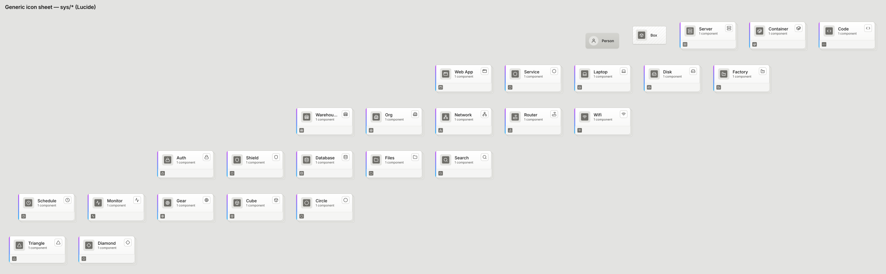 | 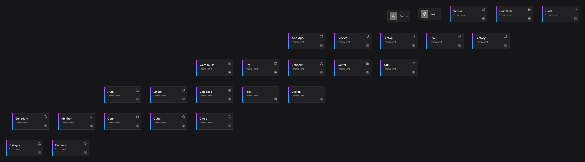 |

## Align Hops

`align` puts two nodes on exactly the same axis, for when the automatic layout leaves them a few pixels apart and the near-miss looks like a mistake.

Source: [`cases/20-align-hops.squinch`](cases/20-align-hops.squinch)

| light | dark |
|---|---|
|  | 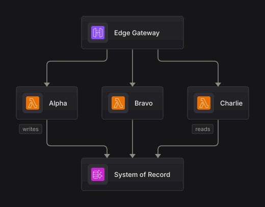 |

## Logos

The `logos` pack: marks for the frameworks, databases and tools that make up the half of a stack your cloud provider did not build.

Source: [`cases/21-logos.squinch`](cases/21-logos.squinch)

| light | dark |
|---|---|
|  | 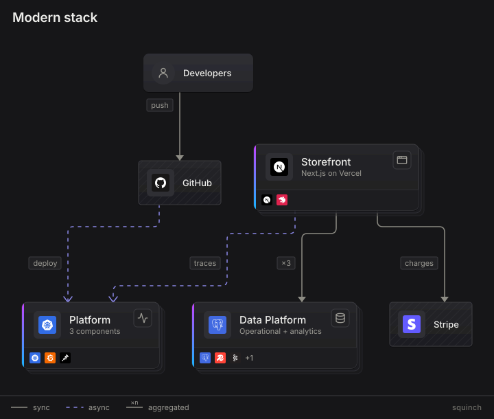 |

## Channel

`channel` merges several connections into one trunk where they all arrive at the same place, so a shared store is approached once instead of by a fan of near-parallel lines. The connections are still declared individually.

Source: [`cases/22-channel.squinch`](cases/22-channel.squinch)

**`plain`**

| light | dark |
|---|---|
| 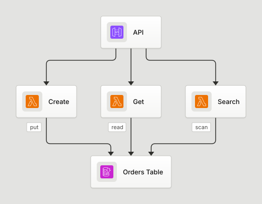 | 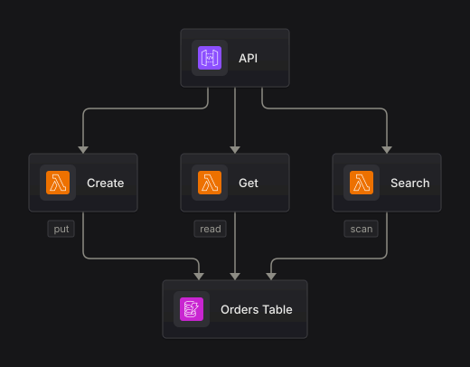 |

**`bussed`**

| light | dark |
|---|---|
|  | 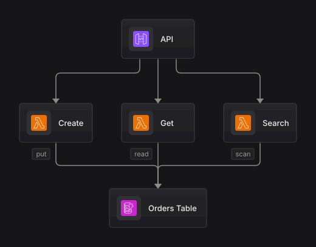 |

## Note Anchors

Every place a note can go: beside, above or below a node, attached to a connection, or pinned to one of the four corners of the diagram.

Source: [`cases/23-note-anchors.squinch`](cases/23-note-anchors.squinch)

| light | dark |
|---|---|
| 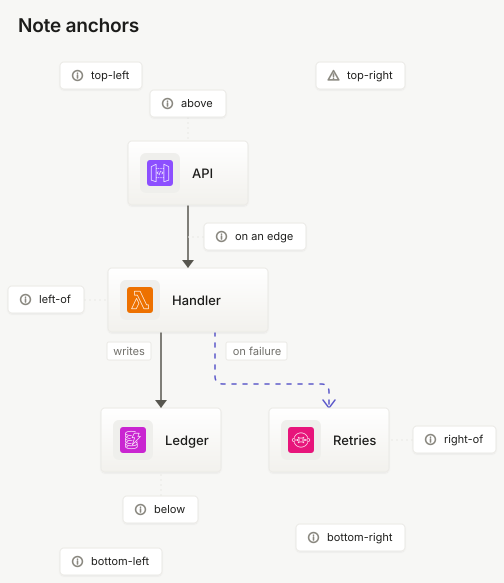 | 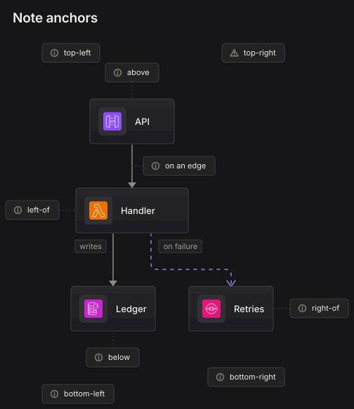 |

## Arrow Kinds

The four kinds of connection — one-way, two-way, asynchronous, and undirected — and how each one is drawn.

Source: [`cases/24-arrow-kinds.squinch`](cases/24-arrow-kinds.squinch)

| light | dark |
|---|---|
| 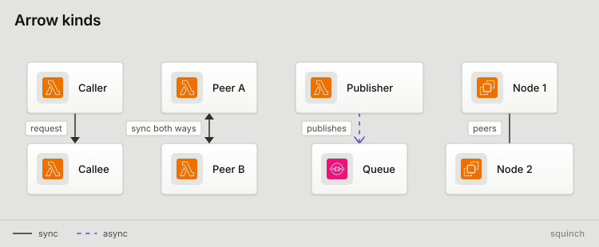 | 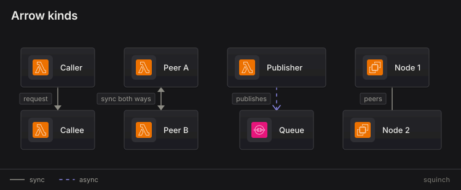 |

## Edge Routing

The `lines` setting, three ways over the same diagram: how an edge *travels*. `orthogonal` turns square corners, `curved` rounds them off, and `straight` runs point to point. How an edge is *drawn and moves* is the other axis — `style:` and `animate:`, case 29-edge-styles.

Source: [`cases/25-edge-routing.squinch`](cases/25-edge-routing.squinch)

**`orthogonal`**

| light | dark |
|---|---|
| 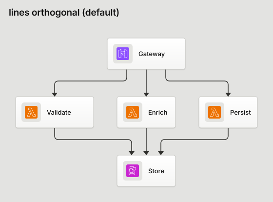 | 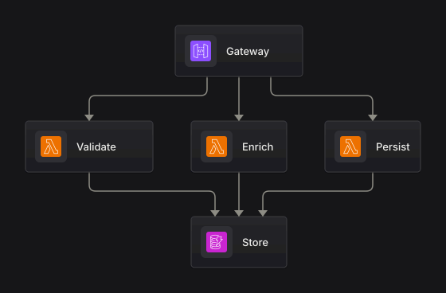 |

**`curved`**

| light | dark |
|---|---|
| 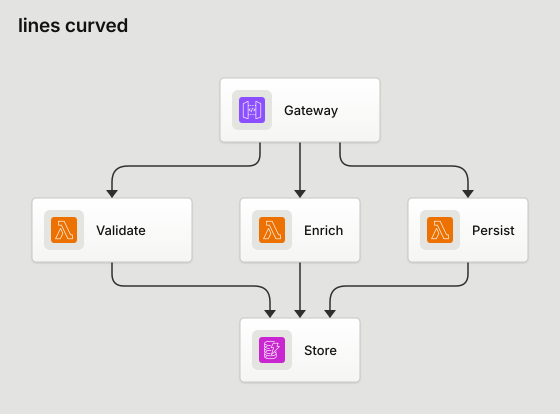 |  |

**`straight`**

| light | dark |
|---|---|
| 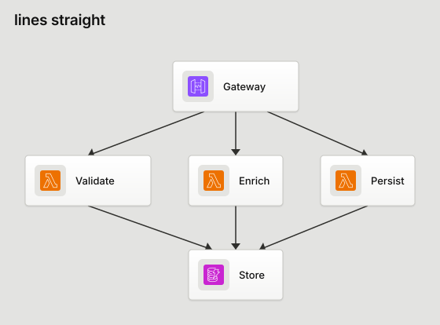 | 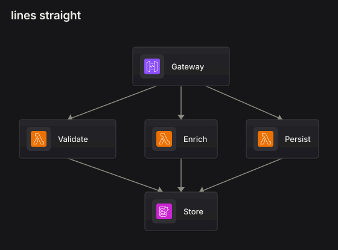 |

## Route Label

`route` controls which side of a node a connection leaves and enters by. When two connections join the same pair of nodes, naming one of their labels picks the one you mean.

Source: [`cases/26-route-label.squinch`](cases/26-route-label.squinch)

| light | dark |
|---|---|
| 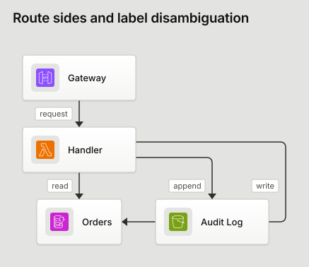 | 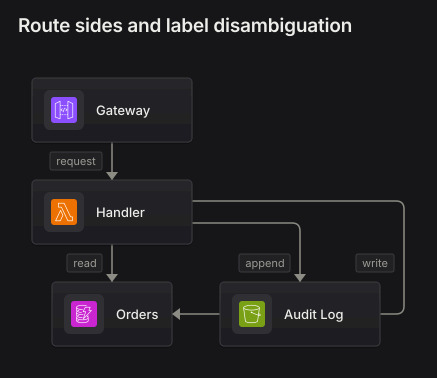 |

## K8s

The k8s pack: official community icons (the blue heptagons from the kubernetes docs), full-colour artwork like aws/azure — no plate, no tint. Canonical ids are kubectl's short names; the long forms alias to them, and this file deliberately uses both spellings so the case exercises the alias table. A namespace draws as a zone with `icon: k8s/ns`, not as a node.

Source: [`cases/27-k8s.squinch`](cases/27-k8s.squinch)

| light | dark |
|---|---|
| 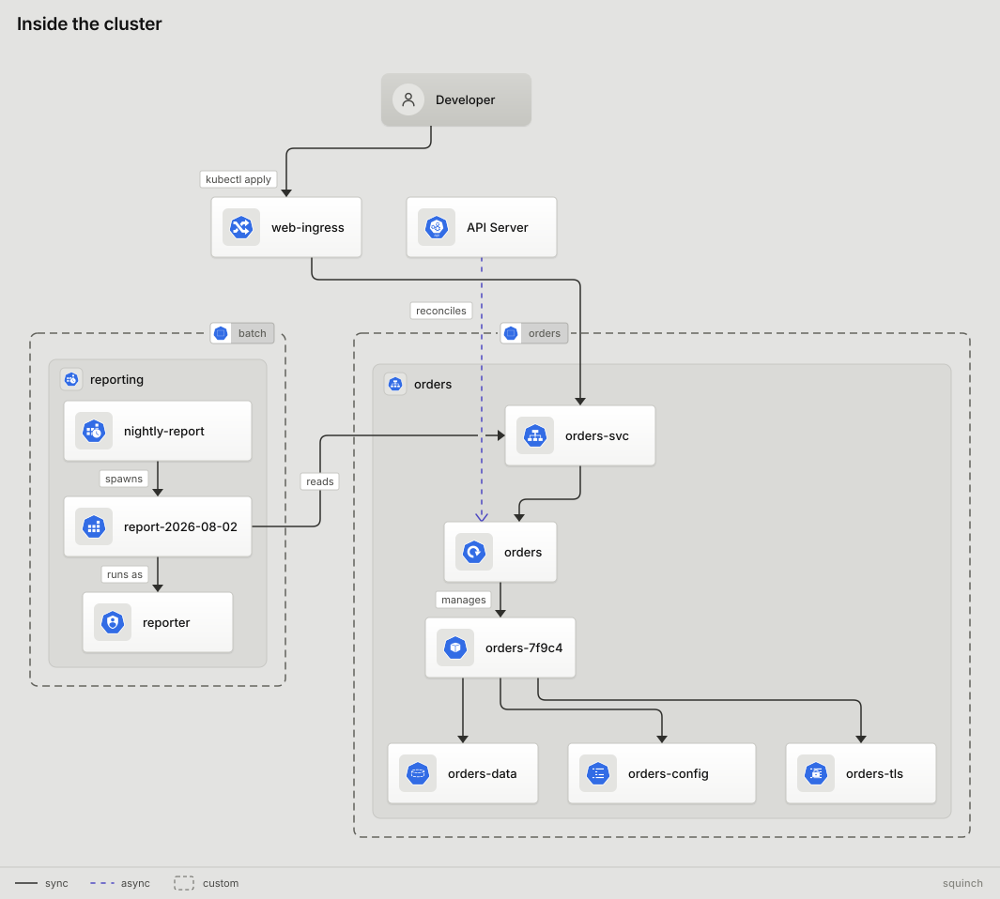 | 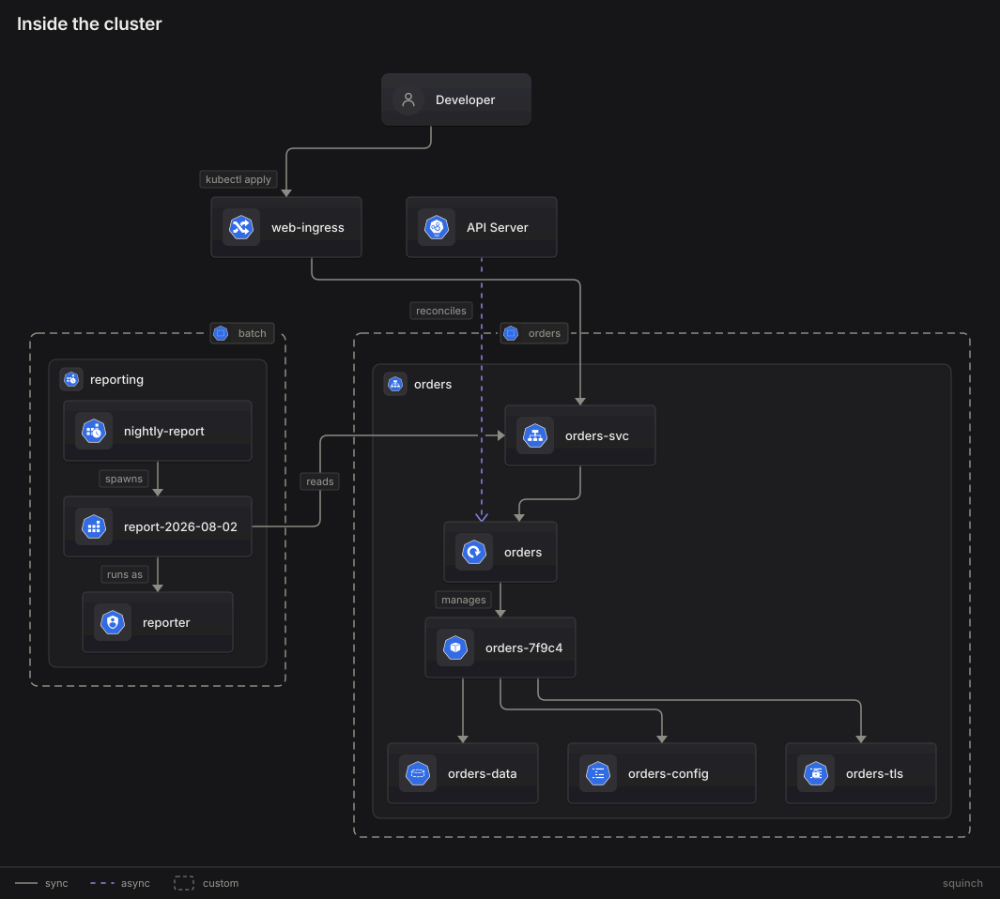 |

## Azure

The azure pack: Microsoft's official Architecture Icons — the gradient artwork is drawn raw like aws/k8s, no plate, no tint. Long marketing names alias to what people actually type (`azure/vnet`, `azure/aks`, `azure/cosmos`), and this file leans on those short forms. A virtual network draws as a zone with `icon: azure/vnet` — the chip inset that keeps full-bleed artwork off the pill border is exercised right here.

Source: [`cases/28-azure.squinch`](cases/28-azure.squinch)

| light | dark |
|---|---|
| 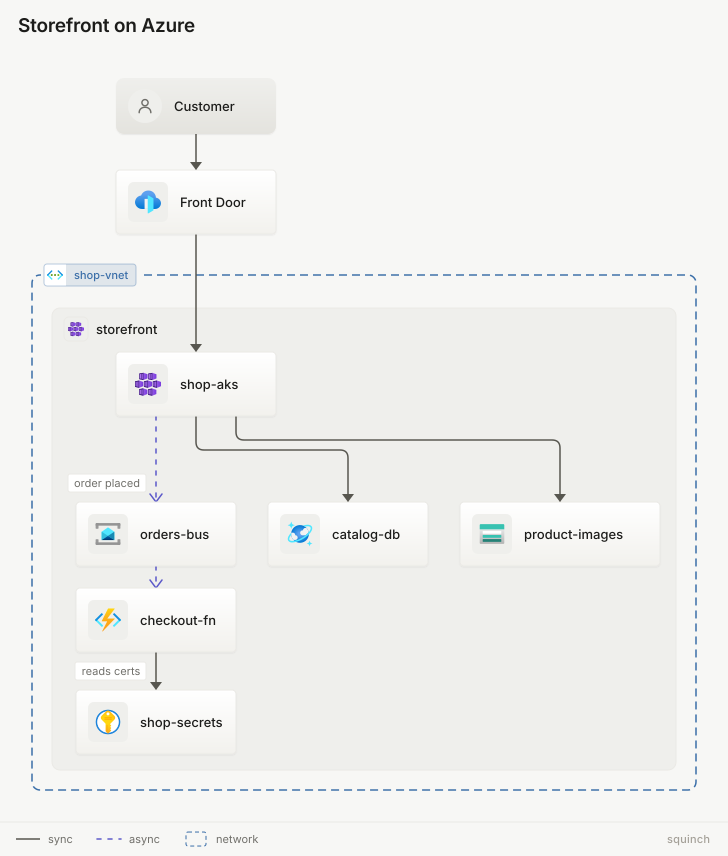 | 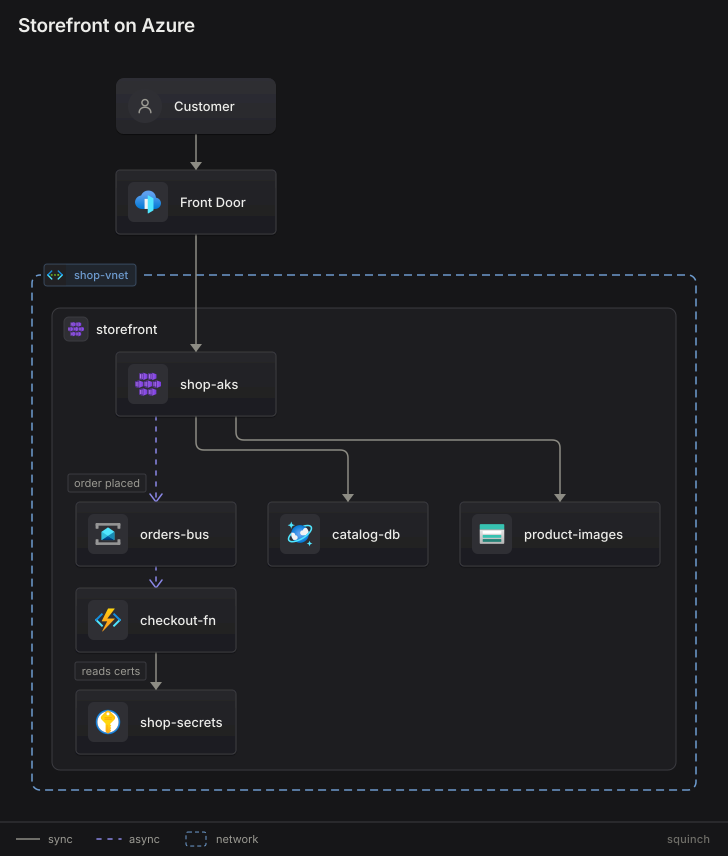 |

## Edge Styles

How an edge is drawn and how it moves: `style: solid | dashed | dotted` and `animate: flow | reverse | slow | fast | packets | pulse | comet`, one hub with each spoke showing one thing. Dash travel needs a pattern, so a sync edge animates by declaring `style: dashed` first; `pulse` breathes and works on solid lines. `comet` is the exception: it rides a dot along the route rather than moving the stroke, so it needs no pattern and is the way to show motion on a plain synchronous call. How an edge *travels* between nodes is the other axis — `lines`, case 25-edge-routing.

Source: [`cases/29-edge-styles.squinch`](cases/29-edge-styles.squinch)

| light | dark |
|---|---|
|  |  |

## Badges

`badge:` puts a vendor mark on a node's icon plate. It exists because some platforms publish no icon set anyone may redistribute — Databricks is the standing example — so there is no pack to install and never will be. Rather than ship someone's extracted artwork, compose two things we already have a licence to: a generic `sys/*` concept for *what the thing is*, and a CC0 brand mark for *whose it is*. The badge is what makes a wall of grey plates legible: every Databricks-owned box is marked, and the Kafka and S3 nodes keep their own icons, so the platform boundary reads at a glance.

Source: [`cases/30-badges.squinch`](cases/30-badges.squinch)

| light | dark |
|---|---|
|  | 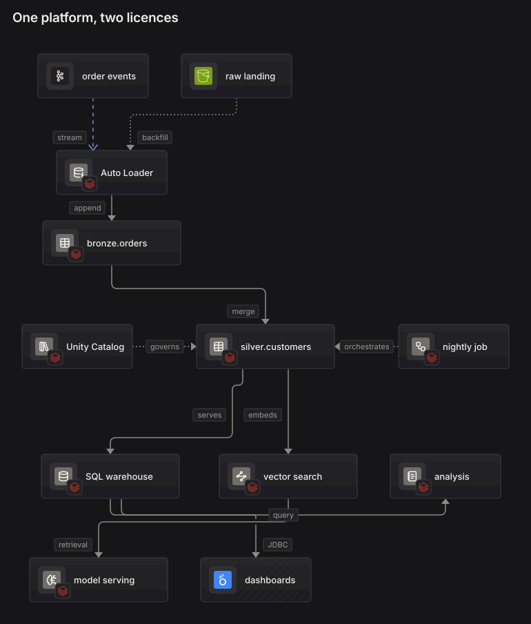 |

## Full Detail

`expand *` — the one deliberate ladder: every container open to leaf depth on one page. Frames nest to keep containment legible; only the outermost carry the recessed fill (depth would otherwise read as darkness), inner boundaries are the line and the label.

Source: [`cases/31-full-detail.squinch`](cases/31-full-detail.squinch)

| light | dark |
|---|---|
| 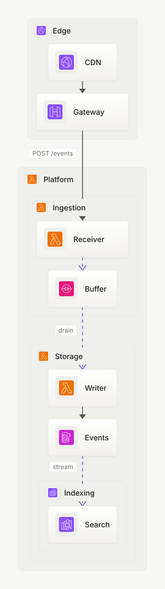 | 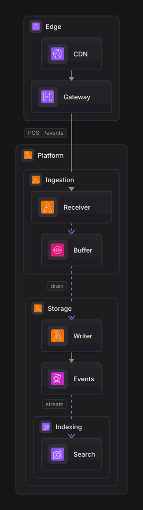 |

## Coplanar Frames

The row that used to break: expanded systems side by side with calls running between them. Same-rank cross-frame edges route wall-to-wall through reserved gutters — straight when the endpoints share a height, a mid-gutter jog when they don't (coplanar.md, approach #5). Before this, ELK saw the calls and silently re-layered the row into a stack.

Source: [`cases/32-coplanar-frames.squinch`](cases/32-coplanar-frames.squinch)

| light | dark |
|---|---|
| 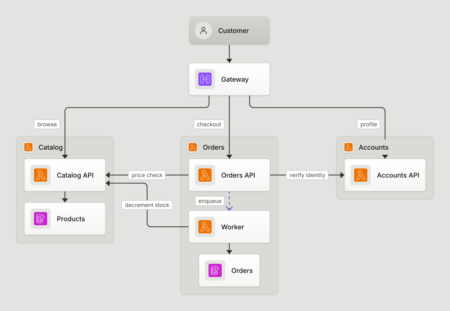 | 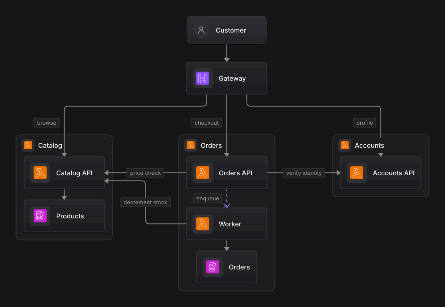 |

## Card Shelf

The card shelf, fully loaded. `icon:` picks the card's own mark instead of inheriting the first child's — here a storefront glyph, deliberately not an AWS service, because the card is the *system* and not any one component. `domain:` stamps a chip on the shelf's right; past three children the preview strip truncates to `+N`. The second card declares neither and shows the defaults: first child's icon, no chip.

Source: [`cases/33-card-shelf.squinch`](cases/33-card-shelf.squinch)

| light | dark |
|---|---|
|  | 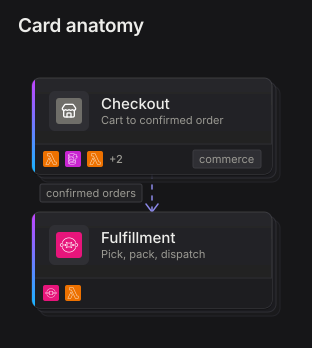 |

## View Axes

The view verbs beyond scope. `only #pci` keeps just the tagged slice — tags cut across systems, so no scope could ever name it. `detail` redraws an outside caller at its real depth instead of as its system's card. And `context off` clears the muted periphery when a view wants nothing but its subject.

Source: [`cases/34-view-axes.squinch`](cases/34-view-axes.squinch)

**`audit`**

| light | dark |
|---|---|
|  | 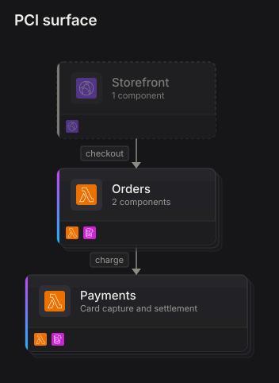 |

**`charge-path`**

| light | dark |
|---|---|
| 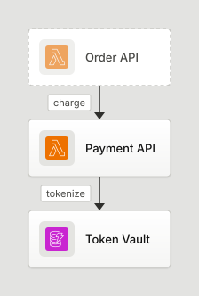 | 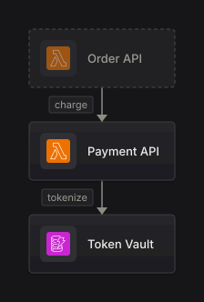 |

**`pay-alone`**

| light | dark |
|---|---|
| 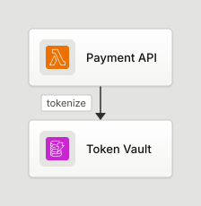 | 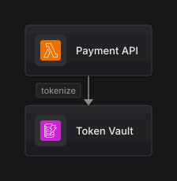 |

## Rows Cols

`rows` pins ranks, `cols` pins the cross axis, and together they are the grid the language has no third construct for: `rows [a b] [c]` composed with `cols [a c] [b]` is a 2×2 with one corner empty. This is the reason the once-planned `grid` statement was dropped.

Source: [`cases/35-rows-cols.squinch`](cases/35-rows-cols.squinch)

| light | dark |
|---|---|
| 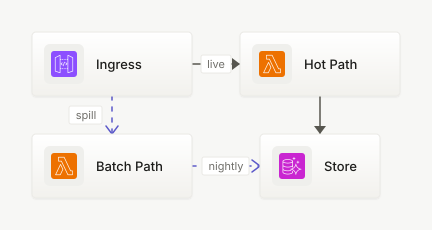 | 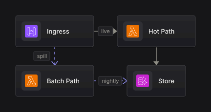 |
