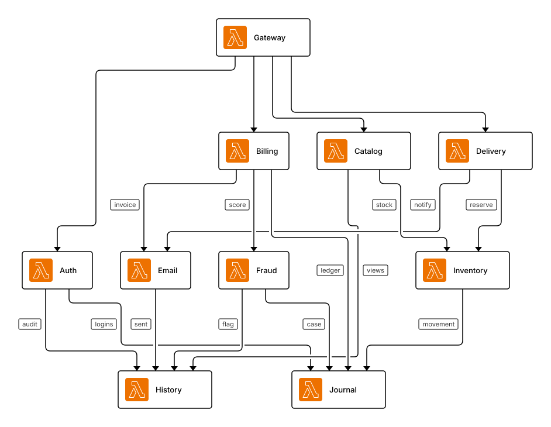
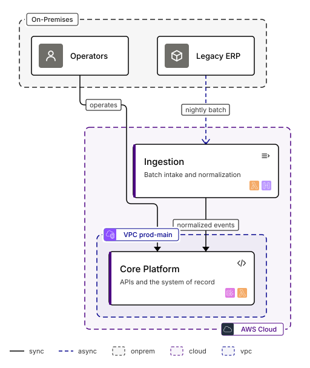
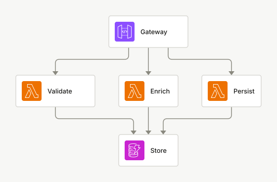
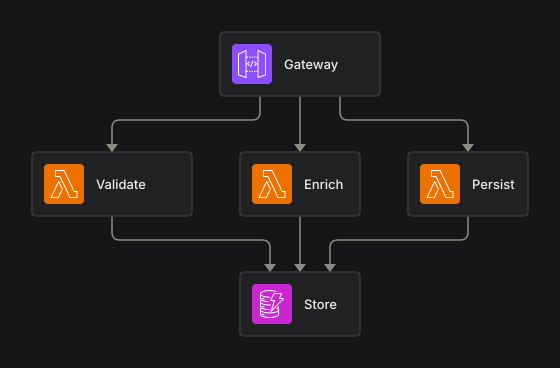
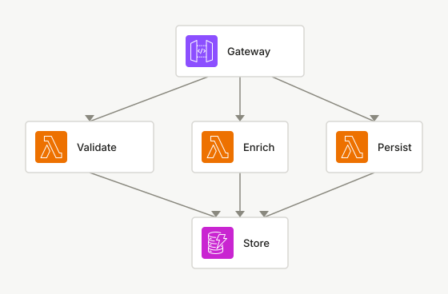
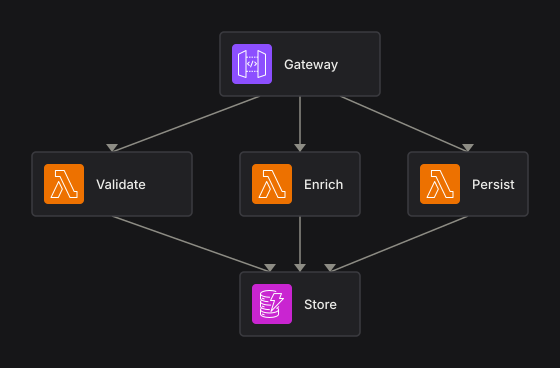

# Lookbook

Stress cases for the renderer, snapshot-locked (CI regenerates and diffs).
Regenerate with `npx tsx lookbook/build.ts`; eyeball every cell before
committing a visual change. What looks bad here becomes the next fix.

## 01-minimal

The smallest possible diagram must still look composed, not lost on canvas.

Source: [`cases/01-minimal.squinch`](cases/01-minimal.squinch)

| light | dark | sketch | sketch-dark |
|---|---|---|---|
|  |  |  |  |

## 02-fan-out

Brutal fan-out: one gateway, twelve handlers. Port spread and stub discipline have to keep this readable.

Source: [`cases/02-fan-out.squinch`](cases/02-fan-out.squinch)

| light | dark |
|---|---|
|  |  |

## 03-fan-in

The mirror image: twelve producers draining into one queue.

Source: [`cases/03-fan-in.squinch`](cases/03-fan-in.squinch)

| light | dark |
|---|---|
|  |  |

## 04-deep-chain

An eight-stage pipeline, laid out left to right.

Source: [`cases/04-deep-chain.squinch`](cases/04-deep-chain.squinch)

| light | dark |
|---|---|
|  |  |

## 05-long-labels

Hostile text: long labels, long descriptions, long edge labels. Truncation must be graceful and pills must never collide.

Source: [`cases/05-long-labels.squinch`](cases/05-long-labels.squinch)

| light | dark |
|---|---|
|  |  |

## 06-dense-mesh

Ten services that all talk to each other far too much. The worst realistic edge-density case: crossings are inevitable, chaos is not.

Source: [`cases/06-dense-mesh.squinch`](cases/06-dense-mesh.squinch)

| light | dark | sketch | sketch-dark | contrast |
|---|---|---|---|---|
|  |  |  |  |  |

## 07-nested-frames

Containers inside a system, both expanded: recessed frames must read as grouping, not decoration, and edges must cross frame borders cleanly.

Source: [`cases/07-nested-frames.squinch`](cases/07-nested-frames.squinch)

| light | dark |
|---|---|
|  |  |

## 08-landscape

A big landscape: eight system cards, a person and an external party. Card grid rhythm, glyph badges, lifted-edge labels.

Source: [`cases/08-landscape.squinch`](cases/08-landscape.squinch)

| light | dark | sketch | sketch-dark |
|---|---|---|---|
|  |  |  |  |

## 09-coplanar-row

Same-rank stress: six peers pinned to one row with chained and skipping edges — adjacent pairs route straight, skips drop into the lane below.

Source: [`cases/09-coplanar-row.squinch`](cases/09-coplanar-row.squinch)

| light | dark |
|---|---|
|  |  |

## 10-highlight-notes

Annotation layer: tag highlight dims the rest; notes anchor to nodes, edges and corners without colliding with anything. `settle -> ledger` carries its own tag rather than inheriting one, so the wire lights up between two nodes that stay dimmed — the case for tagging an edge at all.

Source: [`cases/10-highlight-notes.squinch`](cases/10-highlight-notes.squinch)

| light | dark | sketch | sketch-dark |
|---|---|---|---|
|  |  |  |  |

## 11-async-mesh

Event-driven estate: nearly every edge is async. Dashes must stay legible at density, and the bus must not become a hairball.

Source: [`cases/11-async-mesh.squinch`](cases/11-async-mesh.squinch)

| light | dark |
|---|---|
|  |  |

## 12-lifted-aggregate

Landscape lifting: four internal edges between two systems collapse into one aggregated card-to-card edge with a ×4 badge.

Source: [`cases/12-lifted-aggregate.squinch`](cases/12-lifted-aggregate.squinch)

| light | dark |
|---|---|
|  |  |

## 13-descriptions

show descriptions on every node: two-line leaves must keep vertical rhythm.

Source: [`cases/13-descriptions.squinch`](cases/13-descriptions.squinch)

| light | dark |
|---|---|
|  |  |

## 14-sidecar-routes

The side-car idiom, three times over. `place` is the whole of it: it puts the pair on one row, and same-rank edges route themselves side to side. A `route … from east to west` here would be silently ignored — see 26-route-label for the case where sides actually apply.

Source: [`cases/14-sidecar-routes.squinch`](cases/14-sidecar-routes.squinch)

| light | dark |
|---|---|
|  |  |

## 15-densities

The same model at all three densities — spacing tiers must feel deliberate.

Source: [`cases/15-densities.squinch`](cases/15-densities.squinch)

**`compact`**

| light | dark |
|---|---|
|  |  |

**`comfortable`**

| light | dark |
|---|---|
|  |  |

**`spacious`**

| light | dark |
|---|---|
|  |  |

## 16-legend-titleblock

Footer furniture: an earned legend (sync/async/aggregate/context) and a drafting-style titleblock — stacked or side-by-side depending on width.

Source: [`cases/16-legend-titleblock.squinch`](cases/16-legend-titleblock.squinch)

**`overview`**

| light | dark |
|---|---|
|  |  |

**`pay`**

| light | dark |
|---|---|
|  |  |

## 17-zones

Deployment boundaries: cloud vs on-prem, with a VPC nested inside the cloud. Zones cross-cut ownership; chips straddle the dashed borders.

Source: [`cases/17-zones.squinch`](cases/17-zones.squinch)

| light | dark | sketch | sketch-dark | contrast |
|---|---|---|---|---|
|  |  |  |  |  |

## 18-flows

Numbered flows: the "how does a request actually travel" lens. Steps badge the edges in declaration order; branches keep counting.

Source: [`cases/18-flows.squinch`](cases/18-flows.squinch)

| light | dark |
|---|---|
|  |  |

## 19-glyphs

The generic-icon sheet: `sys/*` on a card badge AND on a plate, one per role, plus builtin person/box. Lucide (ISC) at its own 2px stroke, painted with currentColor so themes tint it — muted on badges, plate-text on plates.

A sample, not the whole pack: 147 ids would make an unreadable sheet. The point is to show every treatment at both sizes, and to catch a stroke weight that reads too heavy on an 18px badge.

Source: [`cases/19-glyphs.squinch`](cases/19-glyphs.squinch)

| light | dark |
|---|---|
|  |  |

## 20-align-hops

Two craft rules at once: `align` snaps entry and store onto one exact axis (ELK alone leaves them ~7px off), and the deliberate crossings below get hop breaks so they can never read as junctions.

Source: [`cases/20-align-hops.squinch`](cases/20-align-hops.squinch)

| light | dark |
|---|---|
|  |  |

## 21-logos

A stack that isn't AWS — the case pack-logos exists for.

Source: [`cases/21-logos.squinch`](cases/21-logos.squinch)

| light | dark |
|---|---|
|  |  |

## 22-channel

Three handlers writing to one table. Declared as three edges — the model is unchanged — but drawn as a single trunk, so the store is approached once instead of being crowded by a fan of near-parallel lines.

Source: [`cases/22-channel.squinch`](cases/22-channel.squinch)

**`plain`**

| light | dark |
|---|---|
|  |  |

**`bussed`**

| light | dark |
|---|---|
|  |  |

## 23-note-anchors

Every note anchor the grammar accepts, in one picture. A note is a sticky chip with a leader line to its anchor (DESIGN §5); the four corner forms pin to the frame instead and have no leader. The relative anchors are the ones to watch — a note beside a node at the edge of the diagram has to grow the canvas to stay visible.

Source: [`cases/23-note-anchors.squinch`](cases/23-note-anchors.squinch)

| light | dark |
|---|---|
|  |  |

## 24-arrow-kinds

The four arrow kinds side by side: one head, two heads, an open chevron for async, and none at all. The arrowhead is the only thing carrying the distinction, so if any two of these ever draw alike the diagram is asserting something about the architecture that is not true — the worst kind of wrong for a drawing.

Source: [`cases/24-arrow-kinds.squinch`](cases/24-arrow-kinds.squinch)

| light | dark |
|---|---|
|  |  |

## 25-line-styles

One model, three routings. The same graph three times, so the `lines` setting is the only thing changing on screen: `orthogonal` turns square corners, `curved` rounds them wide, `straight` runs point to point and ignores the grid entirely.

Source: [`cases/25-line-styles.squinch`](cases/25-line-styles.squinch)

**`orthogonal`**

| light | dark |
|---|---|
|  |  |

**`curved`**

| light | dark |
|---|---|
|  |  |

**`straight`**

| light | dark |
|---|---|
|  |  |

## 26-route-label

Where `route` sides actually apply — the case 14-sidecar-routes points at.

Sides are fed to ELK, and ELK only routes edges that SPAN rows. A same-rank edge bypasses it for our own coplanar router, which picks its own sides, so a `from`/`to` there is ignored, and says so. Everything below crosses rows, so every hint bites.

Also the parallel-edge disambiguator: two edges between the same pair are legal, and a bare `route a -> b` cannot say which one you meant — that is a check error. The label picks one.

Source: [`cases/26-route-label.squinch`](cases/26-route-label.squinch)

| light | dark |
|---|---|
|  |  |
